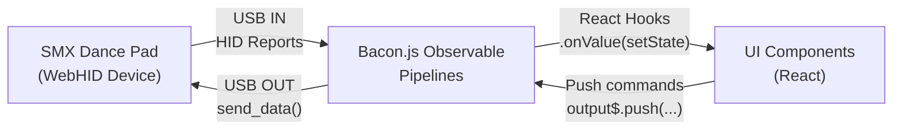
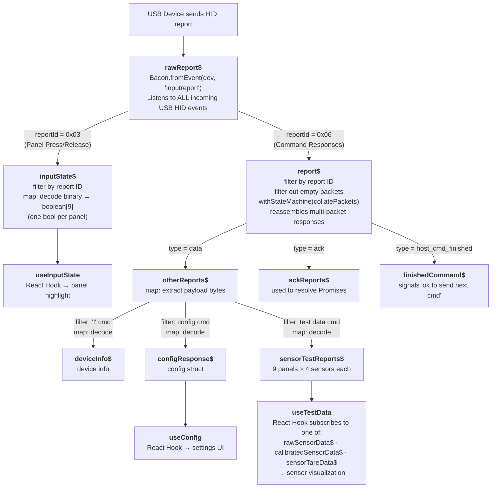
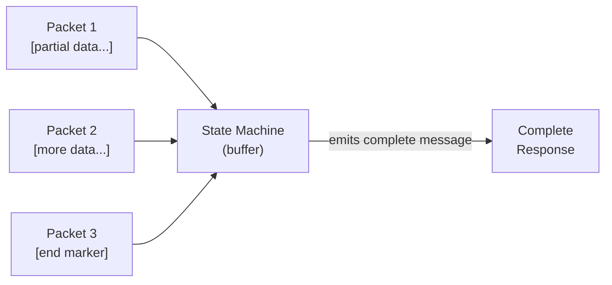
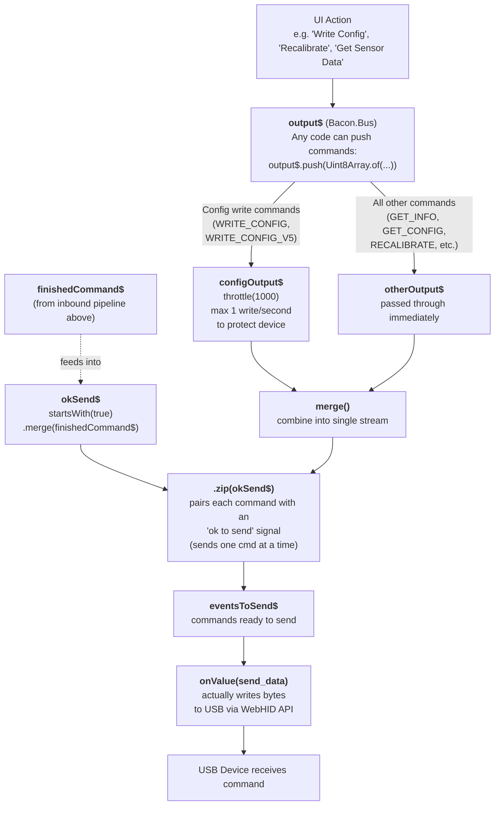
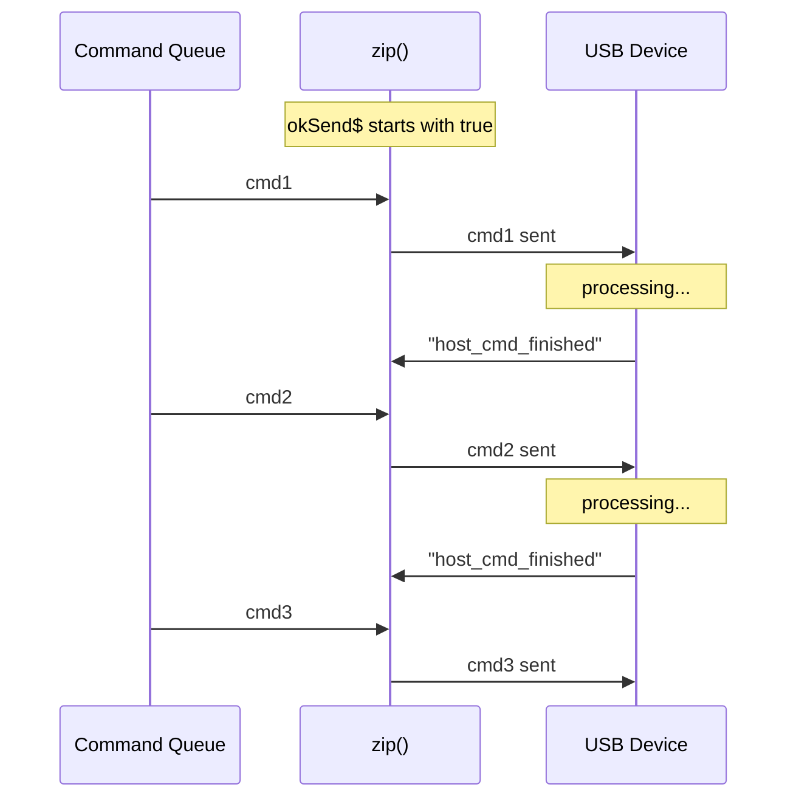
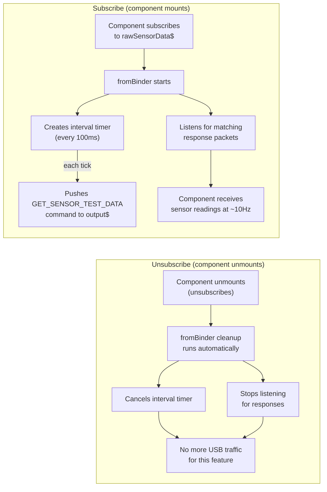

# Bacon.js Observable Data Flow: USB Device Communication

This document explains how [Bacon.js](https://baconjs.github.io/) observables manage
the bidirectional data flow between the web UI and a USB (WebHID) dance pad device.

## What is an Observable?

Think of an observable as a **conveyor belt for data**. Values arrive over time (like
USB packets), and you can attach workers along the belt to filter, transform, or react
to each item. You set up the belt once, and it handles data automatically as it flows.

Key Bacon.js concepts used here:
- **EventStream** - a conveyor belt of discrete events (e.g. each USB packet)
- **Bus** - a special stream you can manually push values into (like a hopper)
- **filter()** - only lets matching items through
- **map()** - transforms each item into something else
- **withStateMachine()** - remembers previous items to assemble multi-part messages
- **merge()** - combines two belts into one
- **zip()** - pairs items from two belts 1-to-1 (used for send/ack synchronization)
- **throttle(ms)** - limits how often items pass through
- **onValue(fn)** - the end of the belt; runs your function for each item

---

## High-Level Architecture



---

## Data Flowing IN (Device to UI)

When the device sends data, it flows through this pipeline:



### How Multi-Packet Reassembly Works

USB HID has a max packet size, so large responses arrive in pieces.
The `withStateMachine(collatePackets)` step remembers previous chunks:



---

## Data Flowing OUT (UI to Device)

When the UI sends a command, it flows through this pipeline:



### Why zip() Matters

The `zip()` operator ensures **one command at a time**. It pairs each outgoing
command with an "ok to send" signal from the device. Without this, we could
flood the device with commands faster than it can process them.



---

## Request/Response Pattern

Many operations follow a push-then-listen pattern:

```
  // 1. Push a command into the output bus
  this.events.output$.push(Uint8Array.of(API_COMMAND.GET_DEVICE_INFO));

  // 2. Wait for the matching response on an input stream
  //    firstToPromise() converts the next stream event into a Promise
  return this.deviceInfo$.firstToPromise();
```

This converts the observable pattern into familiar async/await:

```typescript
  // In practice:
  async init() {
    await this.updateDeviceInfo();   // push GET_INFO cmd, await response
    await this.updateConfig();       // push GET_CONFIG cmd, await response
  }
```

---

## Sensor Test Mode: Lifecycle-Managed Streams

The sensor test feature uses `fromBinder()` to create streams that **automatically
manage their own setup and teardown**:



Similarly, `engagePanelTestMode$` keeps the device in test mode only while
something is subscribed, and automatically exits test mode on unsubscribe.

---

## Connecting to React

React hooks in `ui/stage/hooks.ts` bridge observables to component state:

```typescript
  function useInputState(stage) {
    const [panelStates, setPanelStates] = useState(null);

    useEffect(() => {
      // Subscribe: stream values update React state
      // onValue returns an unsubscribe function
      return stage?.inputState$
        .throttle(UI_UPDATE_RATE)
        .onValue(setPanelStates);
      // React calls the unsubscribe on cleanup ^
    }, [stage]);

    return panelStates;
  }
```

The pattern is always the same:
1. **Subscribe** to an observable with `.onValue(setStateFunction)`
2. **Return** the unsubscribe function as the useEffect cleanup
3. React state updates trigger re-renders automatically

---

## Complete Round-Trip Example

**User changes a config setting and clicks Save:**

```mermaid
sequenceDiagram
    participant UI as React Component
    participant Stage as SMXStage
    participant Bus as output$ Bus
    participant Pipe as Observable Pipeline
    participant Dev as USB Device

    UI->>Stage: writeConfig()
    Stage->>Bus: push([WRITE_CONFIG, length, ...bytes])
    Note over Bus,Pipe: configOutput$ throttles to 1/sec<br/>merge → zip(okSend$)
    Pipe->>Dev: send_data(dev, bytes)

    Dev->>Pipe: ACK packet (HID report)
    Note over Pipe: rawReport$ → report$<br/>(collatePackets reassembles)<br/>→ ackReports$ emits
    Pipe->>Stage: ackReports$.firstToPromise() resolves

    Stage->>Bus: push([GET_CONFIG])
    Pipe->>Dev: send_data(dev, bytes)
    Dev->>Pipe: Config response bytes
    Note over Pipe: rawReport$ → report$<br/>→ otherReports$<br/>→ configResponse$ (filter + decode)

    Pipe->>UI: useConfig hook onValue fires
    Note over UI: React re-renders with<br/>updated settings
```



---

## Key Files

| File | Role |
|------|------|
| `sdk/smx.ts` | Core observable pipelines (`SMXEvents`) and device API (`SMXStage`) |
| `sdk/state-machines/collate-packets.ts` | Multi-packet reassembly state machine |
| `sdk/packet.ts` | Low-level USB send (`send_data`) |
| `sdk/interface.ts` | `StageLike` interface defining all public observables |
| `sdk/mock.ts` | Mock stage using Bacon operators for UI development |
| `ui/stage/hooks.ts` | React hooks bridging observables to component state |
| `ui/pad-coms.tsx` | WebHID device connection lifecycle |
